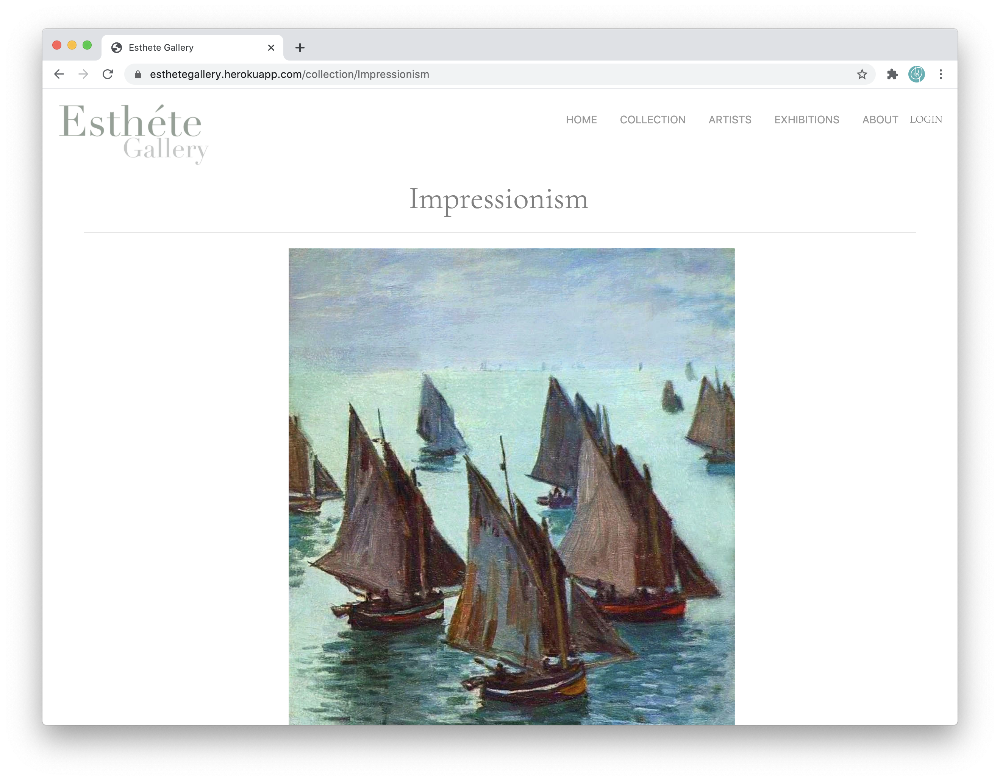

## Project: Eshete

# Description: 

Esthete Gallery is an art gallery management system that allows an art gallery owner to maintain details of artists and paintings with great ease. With the help of this app, gallery owners can store, view, and maintain inventory. In addition to maintenance, the app also allows owner to post future events and keep customers/users upto date on exhibitions being held by the Gallery.
  
# Table of Contents:
  
  * [Title](#Project)
  * [Description](#Description)
  * [Instillation](#Instillation) 
  * [Usage](#User-Story)
  * [Future Development](#Future-Development)
  * [Contributing](#Contributors)
  * [Installation](#Test-Instructions) 
  * [Video Walkthrough](#)

# Installation 

 The dependencies for this app are: bcryptjs, cloudinary, dotenv, express, mysql2, passport.js, and sequelize. 

# User-Story 
 
Front End User: 

When a customer arrives at the gallery's homepage, they can either view a collection by the art style, select a specific artist, or see what the upcoming exhibits are. 

  

If the user selects a particular artist, they will be directed to the artist page to view all of the existing pieces that the specific artist has in the gallery.

  

If the user selects a particular collection of works such as Impressionism, they will see all the current pieces of art, from multiple artists, of Impressionism. When scrolling through the available pieces, the user can select "Read More" to learn more about the piece.

  

Back End User:

The art gallery owner can sign into their account from the homepage of the website. The user page houses a series of forms. 

  

These forms allow the gallery owner can customize what styles of painting they have, what artists are in their gallery, and what artwork is currently available—the information the user inputs stores in a database. The database is linked to the front end of the site to display all the gallery elements. The gallery owner also has the option of announcing their upcoming exhibits. 

# Future-Development

What's most exciting about this application is the future possibilities are endless. We are looking forward to adding a direct marketing system that will work with the database information to pinpoint interested buyers from our existing customer list. 

  

By entering specific details about the available artwork and our customers' interest, we plan to add an alert system that will notify the gallery owner that they match in sales once the appropriate criteria is made. They will then have a feature where they can select an artist or artwork, and an automatic marketing email will be created and sent to the customer. 

# Contributors 

This application was developed by Sumayyah Mariam, Cristino Perez, Bethelhem Legesse, and Kathryn Sherazi 

# Instillation-Instructions 

If installed locally, this app can run through node and will require an npm install. 

# Important Links

Video Walkthrough: https://drive.google.com/file/d/1acroPcImHTuySFs7bU-tO9XBqeI8qcLL/view

Heroku Deployment Link: https://esthetegallery.herokuapp.com/

GitHub Repository: https://github.com/Sumayyahm/Project2

Eshete  Copyright (C) 2020 This project was created by 

  